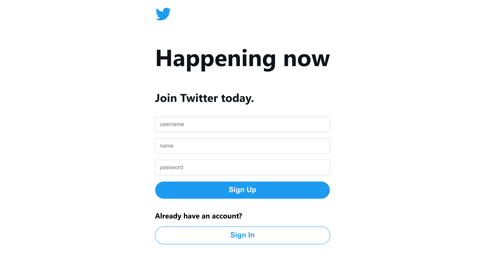
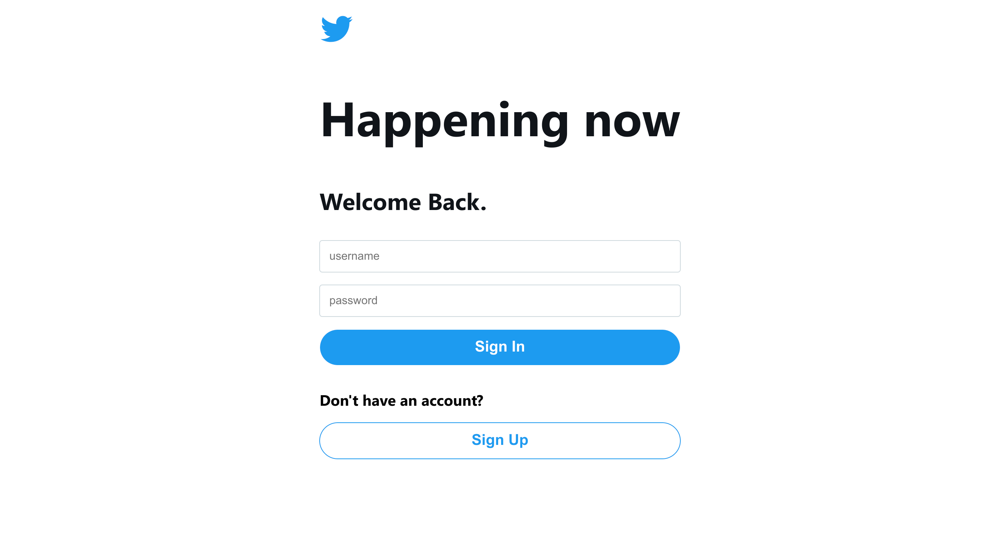
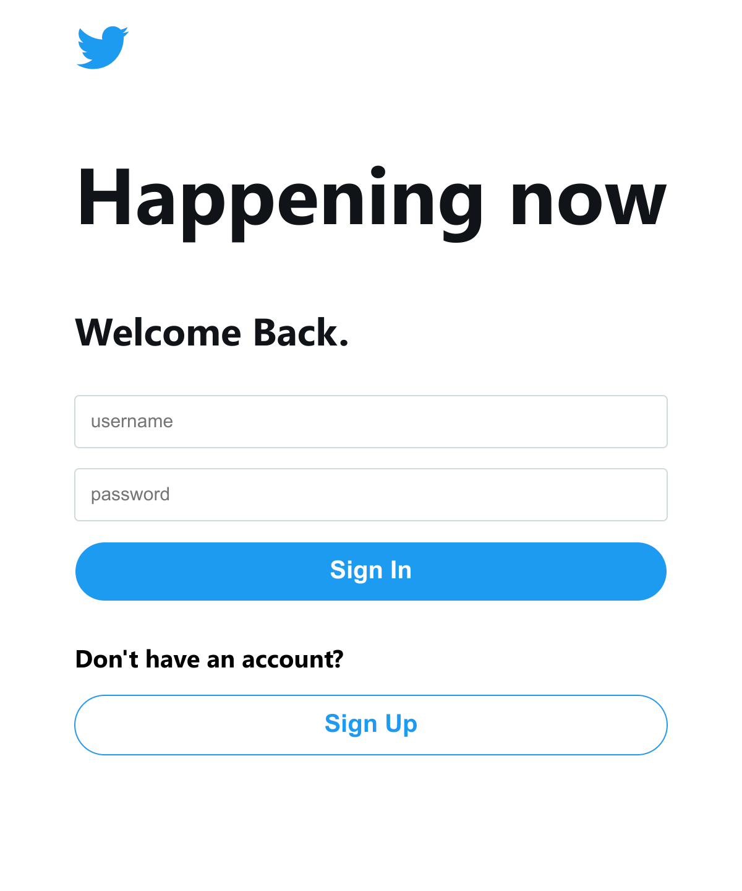
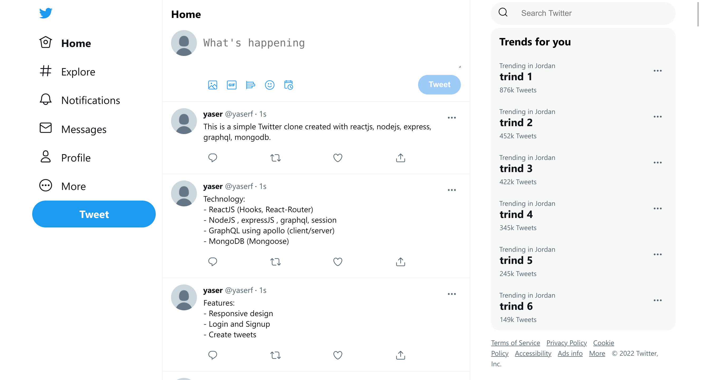
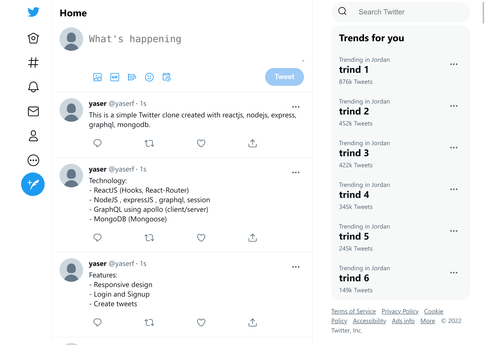
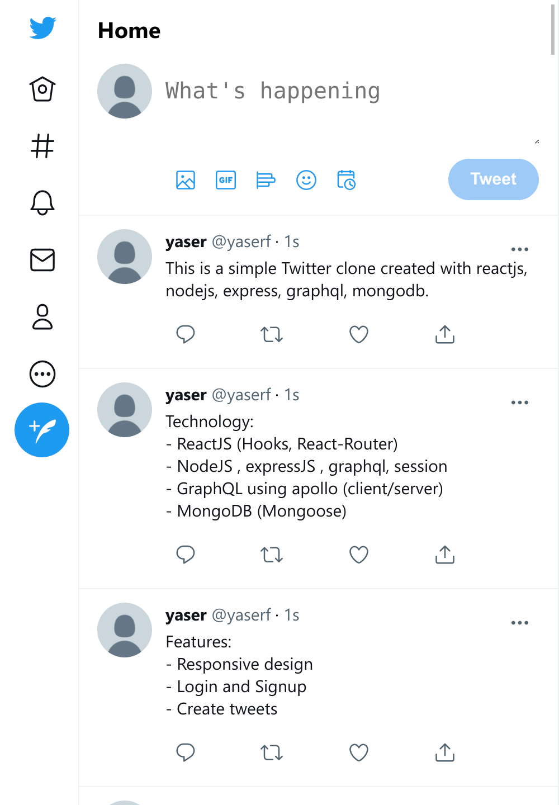

A simple Twitter clone created with reactjs, nodejs, express, graphql, mongodb.

# Screenshots




<!--  -->
<!--  -->





# Technology used

- ReactJS (Hooks, React-Router)
- NodeJS , expressJS , graphql, session
- GraphQL using apollo (client/server)
- MongoDB (Mongoose)

# Features

- Responsive design
- Login and Signup
- Create tweets

# Installation

## Clone the project

```shell
git clone git@github.com:yasser570/twitter_clone.git
```

## MongoDB

- [Install MongoDB](https://docs.mongodb.com/manual/administration/install-community/)
- Make sure that MongoDB is running

```shell
sudo systemctl start mongod
sudo systemctl status mongod
```

## Backend

- Install dependencies

```shell
cd backend
npm install
```

- Build and start

```shell
npm run build && node dist/index.js
```

## Brontend

- Install dependencies

```shell
cd frontend
npm install
```

- Build and start

```shell
npm run build
npm install -g serve
serve -s build
```
